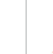
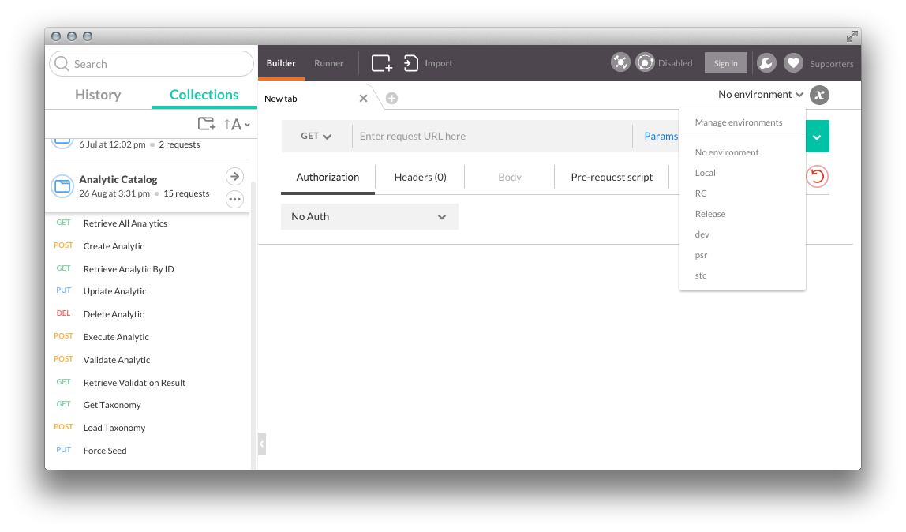
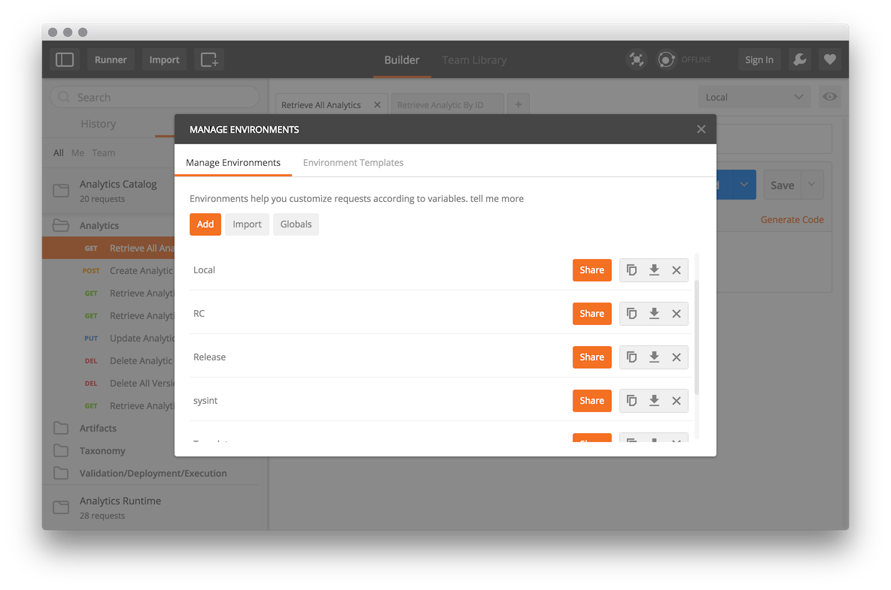

### 

### API Reference
These request collections conform to the Analytics Framework API set, which is documented at [predix.io/api](https://www.predix.io/api). User guides for the API, which cover common use cases and workflows, can be found on the full [Analytics Framework](https://docs.predix.io/en-US/content/service/analytics_services/analytics_framework/) documentation site.

### Request Collections
These files contain sample requests that can be imported directly into Postman through the "Import" link near the top-center of the window. You can then customize and test out your REST requests to aid in implementing your applications.

* [Analytics Framework](./Analytics_Framework.postman_collection.json)
* [UAA Token for Analytics Services](./UAA_Token_for_Analytics_Services.json.postman_collection): Use these templates to retrieve the tokens needed to call Analytics APIs

If you have trouble importing Postman files using this method, you can try directly pasting the contents of the Postman files using the "Raw Text" tab within the Import window.

### Environment Variables
Postman allows you to create "Environments" which can have a set of variables. That way, you can use the same Postman request for multiple environments. Variables are referenced using double curly bracket notation (ex: {{token}}) anywhere in the request (URL, params, header, body). 

The collections above assume that you have the following set of variables defined, either for a single environment, or at a global level. You can import the [Template Environment](./Template.postman_environment.json) and fill out the values of the following environment variables.

* **token** : The full token obtained from your UAA service
* **tenant_id** : The Predix Zone ID of your Analytics Framework instance (obtained from the VCAP environment in your Analytics Framework service instance)
* **catalog_uri** : The hostname of the instance of Analytics Catalog (obtained from the VCAP environment in your Analytics Framework service instance)
* **config_uri** : The hostname of the instance of Orchestration Configuration (obtained from the VCAP environment in your Analytics Framework service instance)
* **execution_uri** : The hostname of the instance of Orchestration Execution (obtained from the VCAP environment in your Analytics Framework service instance)
* **scheduler_uri** : The hostname of the instance of Analytics Scheduler Service (obtained from the VCAP environment in your Analytics Framework service instance)
* **monitoring_uri** : The hostname of the instance of Orchestration Monitoring Service (obtained from the VCAP environment in your Analytics Framework service instance)

To manage your environment, use the drop down menu to the left of the circled "x" in the top-right corner of the window and select "Manage Environment" like below:

This will bring up a popup from which you add/import environments and edit environment variables (including global variables):

### Archived Collections
The Analytics Catalog and Runtime services are deprecated. However, if you are still using these services, you can refer to the following archived Postman files:

* [Analytics Catalog](./archive/Analytics_Catalog.json.postman_collection) 
* [Analytics Runtime](./archive/Analytics_Runtime.json.postman_collection) 
* [Template Environment](./archive/Template.postman_environment) 